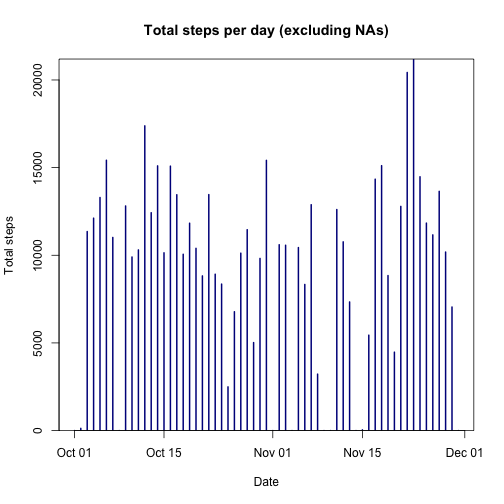
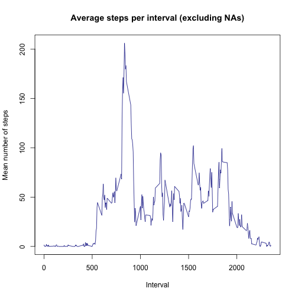
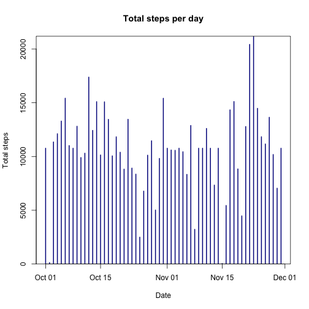
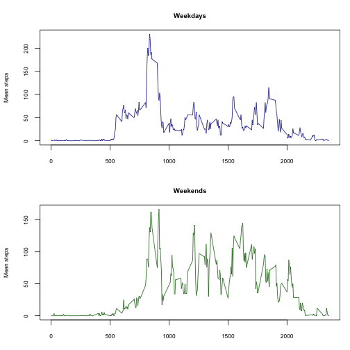

## Loading and preprocessing the data

I used lubridate to handle the conversion of the time series, so it needs to be 
loaded....also set the scipen option to prevent KnitR converting numbers to 
scientific notation.


```r
library(lubridate)

options(scipen=999)
```

Now we check to see if the activity file is already in the directory. If it isn't
then we go to the website, download it, unzip it then tidy-up by removing the
zipped file.


```r
zipFileDownloadLocation = "https://d396qusza40orc.cloudfront.net/"
zippedFile = "repdata%2Fdata%2Factivity.zip"
File <- "activity.csv"

if(all(File %in% dir()) == FALSE) { 
        
        download.file(paste0(zipFileDownloadLocation, zippedFile), 
                       zippedFile, method = "curl")
        unzip(zippedFile, unzip = "internal")
        
        ## clean up - remove the temp zip file....
        
        file.remove(zippedFile)
} 
```

Now we I read in the data...


```r
Data <- read.table(File, stringsAsFactors = FALSE, header = TRUE, sep = "," , 
                na.strings = "NA",colClasses = c("numeric","Date","numeric"))
```

## What is mean total number of steps taken per day?

To find the answer to this question we split up the steps (removing NAs) by date
and summate.


```r
daysSteps <- sapply(split(Data$steps,Data$date),sum, na.rm=TRUE)
```

Plotting this data as a histogram of the date vs. the number of step. Note this
data could also be plotted as a frequency histogram for the number of steps
using hist().


```r
par(yaxs ="i", mfrow=c(1,1))
plot(ymd(names(daysSteps)),daysSteps, type = 'h',
        xlab = "Date",
        ylab = "Total steps",
        main = "Total steps per day (excluding NAs)",
        lwd = 2,
        col= "dark blue",
        ylim = c(0,max(daysSteps)))
```



Next I calculated the median an mean for the data set with missing data.


```r
Q1Median <-median(daysSteps)

Q1Median
```

```
## [1] 10395
```

```r
Q1Mean <-round(mean(daysSteps),2)

Q1Mean
```

```
## [1] 9354.23
```

The median is 10395 and the mean is 9354.23

## What is the average daily activity pattern?

To create a time series plot we split the steps by interval, removing NAs and
find the mean for each interval across the 61 days in the data.


```r
aveStepsPerInterval <- sapply(split(Data$steps,Data$interval),mean, na.rm=TRUE)
```


Plotting this as a time series 

```r
par(mfrow=c(1,1))
plot(names(aveStepsPerInterval),aveStepsPerInterval, type = 'l',
        xlab = "Interval",
        ylab = "Mean number of steps",
        main = "Average steps per interval (excluding NAs)",
        lwd = 1,
        col= "dark blue")
```



To show which one interval has the number of sets we can subset the time series
data to only include the rows with the maximum value.

```r
MaxInterval <-subset(aveStepsPerInterval, aveStepsPerInterval==max(aveStepsPerInterval))
MaxInterval
```

```
##      835 
## 206.1698
```

This shows the interval 835 has the maximum value of 206.1698113

## Imputing missing values

Summing up the NAs to find the number of NAs in the data


```r
missingSteps <-sum(is.na(Data$steps))
missingSteps
```

```
## [1] 2304
```

Gives 2304 NAs

To create the imputed data we recycle the averageStepsPerInverval along the Data 
for each of the 61 days. 

To make it a bit easier I have put the average steps into a new column on the 
original data, then looped through the data and either put the average into a 
newSteps Column where there is an NA or the original steps value in to the 
newSteps column where it isn't an NA. This is then subset into a 'newData' 
dataframe and the column names updated in this new frame. 


```r
Data$imputedSteps <-aveStepsPerInterval

Data$newSteps <-NULL
p = 1
for(i in seq_along(Data$steps)) {
if (is.na(Data$steps[p])==TRUE) Data$newSteps[p] <- Data$imputedSteps[p] 
else Data$newSteps[p] <- Data$steps[p]
p <- p+1
}

newData <- subset(Data, select = c(newSteps,date,interval))
colnames(newData)[1] <-"steps"

head(newData)
```

```
##       steps       date interval
## 1 1.7169811 2012-10-01        0
## 2 0.3396226 2012-10-01        5
## 3 0.1320755 2012-10-01       10
## 4 0.1509434 2012-10-01       15
## 5 0.0754717 2012-10-01       20
## 6 2.0943396 2012-10-01       25
```


Applying the same technique from part 1 above with the imputed data...


```r
newdaysSteps <- sapply(split(newData$steps,Data$date),sum, na.rm=TRUE)

par(yaxs ="i")
plot(ymd(names(newdaysSteps)),newdaysSteps, type = 'h',
        xlab = "Date",
        ylab = "Total steps",
        main = "Total steps per day",
        lwd = 2,
        col= "dark blue",
        ylim = c(0,max(daysSteps)))
```



```r
imputedMedian <- round(median(newdaysSteps),2)
imputedMedian
```

```
## [1] 10766.19
```

```r
imputedMean <- round(mean(newdaysSteps),2)
imputedMean
```

```
## [1] 10766.19
```

We get the new median of 10766.19 which has increased vs. the original 
median of 10395. 

The new mean with the imputed data of 10766.19 has also increased vs.
the original mean of 9354.23.

The most obvious sign of the differences is in the first day where there were no
steps in the data with NAs but around 10,000 steps in the imputed version (in
fact the first day values = the mean steps as all values are imputed). 

## Are there differences in activity patterns between weekdays and weekends?

To work this out we create a new column to put the type of day (weekday or weekend)
into and then loop though the days to work out which type they are. Finally I 
convert the column to a factor.


```r
newData$dayType <-NULL
p = 1
for(i in seq_along(newData$steps)) {
if (weekdays(newData$date[p]) %in% c("Saturday", "Sunday")) 
                newData$dayType[p] <- "Weekend"
        else newData$dayType[p] <- "Weekday"
p <- p+1
}

newData$dayType <- as.factor(newData$dayType)
```

Now I subset the data into two sets (I could of used a recursive split but 
decided to use base plot to produce the diagrams so easier to break it up into
two chunks to plot separately in their panels).

Looking at the plots the person appears to be more active during the day at 
weekends....


```r
Weekday <- subset(newData, newData$dayType=="Weekday")
AveWeekday <- sapply(split(Weekday$steps,Weekday$interval),mean, na.rm=TRUE)

Weekend <- subset(newData, newData$dayType=="Weekend")
AveWeekend <- sapply(split(Weekend$steps,Weekend$interval),mean, na.rm=TRUE)

par(mar = c(3,4,3,1), mfrow = c(2,1), cex.main = 0.8, cex.lab = 0.7, cex.axis =0.7)
plot(names(AveWeekday),AveWeekday, type = 'l',
        xlab = "Interval",
        ylab = "Mean steps",
        main = "Weekdays",
        lwd = 1,
        col= "dark blue")

plot(names(AveWeekend),AveWeekend, type = 'l',
        xlab = "Interval",
        ylab = "Mean steps",
        main = "Weekends",
        lwd = 1,
        col= "dark green")
```



